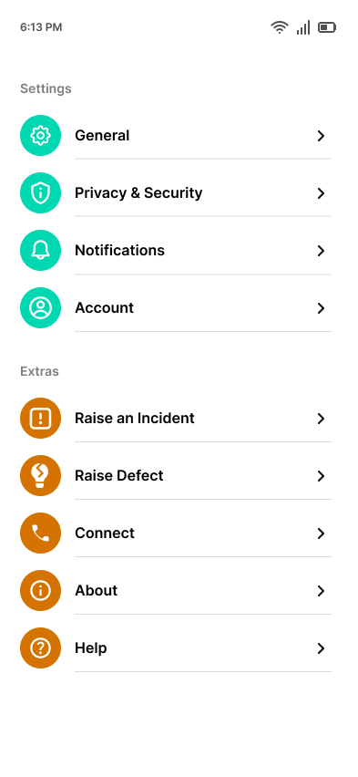
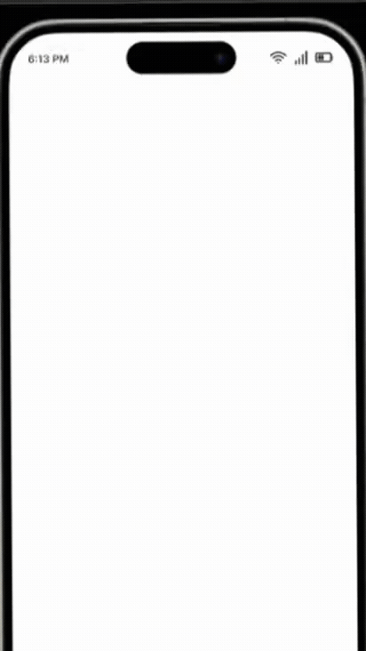

# react-native-stylishlist

Styling of list in context of better UI with less efforts - Increases re-usability.
<br/>
<div>
  <span>Download App & test <b>react-native-stylishlist</b> in your device: <a href="https://drive.google.com/?id=1Z5MRbxWgOzqUpXWSsSVYwQ5jIQ4nevGo&export=download" target="_blank" alt="Download App">Download App</a></span>
</div>
<br/>

<table>
  <tr>
    <td align="center">
      
    </td>
    <td align="center">
      
        <p align="center">List of available options to modify Stylish List View with the help of below props.</p>
    </td>
   </tr>
</table>

## Installation

```sh
npm install react-native-stylishlist
```

## Usage

## Import
```jsx
import StylishList from 'react-native-stylishlist';
```

## Fundamental Usage
```jsx
<StylishList {...props}/>
```

# Configuration - Props
```jsx

const pressEventTrigger = (id : number, itemData: any) => {
  console.warn(id);
  console.warn(itemData);
}

const dataList = [
  {
    leftImageUrl: 'https://xyz.com/30017.png',
    leftImageBackgroundColor: '#00D8B1',
    itemTitle: 'General',
    itemDescription: 'Lorem ipsum dolor sit amet',
    // itemColorCircle: ['#EAEAEA', 'black', 'blue'],
    onPress: pressEventTrigger,
    rightSideText: '$25',
    rightSideTextColor: 'blue'
  },
  {
    leftImageUrl: 'https://xyz.com/30018.png',
    leftImageBackgroundColor: '#00D8B1',
    itemTitle: 'Privacy & security',
    itemDescription: 'Lorem ipsum dolor sit amet Lorem ipsum dolor sit amet',
    // itemColorCircle: ['orange', 'cyan'],
    onPress: pressEventTrigger,
    checkBoxStatus: true,
    rightSideText: '$20',
    rightSideTextColor: 'blue'
  }
];

const props = { 
  heading: 'Settings',
  headingColor: 'black',
  headingSize: 14,
  leftImageUrlFlag: true,
  belowLine: false,
  itemBoxBorder: true,
  itemBoxBorderLeftHighlight: false,
  itemBoxBorderLeftHighlightColor: 'blue',
  rightArrowVisibility: true,
  rightSideTextFlag: true,
  rightSideIcon: 'https://xyz.com/30019.png',
  dataList: dataList,
};
```

## Fundamentals

| Property/Method  |  Type   |  Default  | Description                                                             |
| ---------------- | :-----: | :-------: | ----------------------------------------------------------------------- |
| leftImageUrlFlag | boolean |   false   | Parent flag to showcase left side image                                 |
| leftImageUrl     | string  |     ''    | Public url to showcase image in form of icon                            |
| itemTitle        | string  |     ''    | Title of the item                                                       |
| onPress          | method  |    void   | Attach any method with arguments itemSequence & data to recieve values  |

## Customization (Optionals)

| Property                              |    Type    |         Default         | Description                                            |
| ------------------------------------- | :--------: | :---------------------: | ------------------------------------------------------ |
| heading                               |   string   |            ''           | set heading for the list                               |
| headingColor                          |   string   |            ''           | set heading color, by default grey                     |
| headingSize                           |   number   |            12           | set heading size                                       |
| belowLine                             |  boolean   |           false         | showcase horzontal line after every item in the list   |
| itemBoxBorder                         |  boolean   |           false         | showcase bordered box for every item in the list       |
| itemBoxBorderLeftHighlight            |  boolean   |           false         | highlight left border of the box for styling           |
| itemBoxBorderLeftHighlightColor       |   string   |            ''           | update any hexcode for color, by default black         |
| rightArrowVisibility                  |  boolean   |           false         | set flag to true to showcase right side image in item  |
| rightSideIcon                         |   string   |            ''           | asset path to showcase right side image                |
| rightSideTextFlag                     |  boolean   |           false         | parent flag to showcase text/amount right side         |
| leftImageBackgroundColor              |   string   |            ''           | bg color for image circle, '' will make it transparent |
| itemDescription                       |   string   |            ''           | Description for items                                  |
| itemColorCircle                       |  string[]  |            []           | Add multiple colors for product variants               |
| rightSideText                         |   string   |            ''           | Add text right side, Ex: $25                           |
| rightSideTextColor                    |   string   |            ''           | Add hex color code for right side text color           |

## Future Plans
- [ ] Will come up with checkbox list.
- [ ] Will come up with search functionality.

## Author
Suraj Motwani - Email: suraj.motwani1306@gmail.com

## License

React Native Stylishlist is available under the MIT license. See the LICENSE file for more info.

